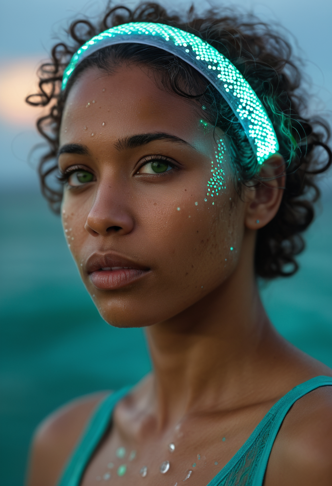
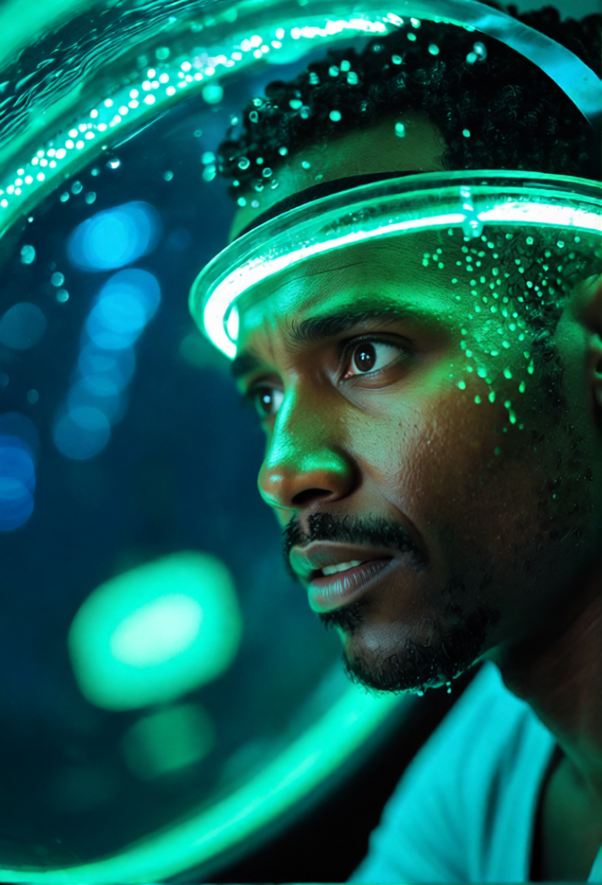

# The Avatarium

**Avatarium** is an open-source AI–VR storytelling platform where digital characters evolve, remember, and respond — merging narrative storytelling with embodied interaction.  
Each avatar carries a distinct backstory, memory, and agency, capable of perceiving, remembering, and reacting to the user and the wider fictional world.  

Built as a modular, VR-ready environment, Avatarium integrates large-language models, generative imagery, and long-term character memory systems to create continuous, emotionally rich experiences. Every exchange can subtly reshape a character’s history — and, in turn, the shared world they inhabit.

---
---

## 🌊 Example Characters

| Portrait | Description |
|----------|-------------|
|   | Sera. A transhuman woman adapted for oceanic environments — calm, perceptive, and spiritually attuned. Sera acts as both guide and mirror, helping users navigate emotional and narrative depths within Avatarium. |
|  Behaviour |

<p align="center"><em>
Together, Sera and Soren represent the twin currents of Avatarium — empathy and inquiry, feeling and thought, always flowing toward new forms of consciousness.
</em></p>

---

## 🌟 Current Capabilities (2025)

### 🧠 Character Memory & Backstory
- YAML‑based long‑term memory and persona system per character.
- Stores dialogue summaries, emotional tone, and factual events.
- Compresses and sends backstory + chat context to LLM for continuity.
- In development: **Backstory Forge UI** for interactive personality editing.

### 💬 Conversational Intelligence
- In‑character dialogue powered by either:
  - **OpenAI GPT‑4o‑mini** (default), or  
  - **Ollama local models** (e.g. `llama3.1:8b`, `phi3:3.8b`).
- Context-aware responses shaped by memory, emotion, and narrative state.

### 🎨 Visual Generation & Editing
- Dynamic image rendering through **ComfyUI** pipelines.
- Real-time visual updates: pose, expression, camera, and mood  
- Two-way link between dialogue and image states  
- Local file structure supports scene-based rendering and visual history  

### 🧩 Architecture Integration
- Unified state object defines `persona`, `memory`, `scene`, and `emotion`.
- Modular backend lets components (LLM, image, memory) sync in real time.
- Supports remote or LAN‑based model execution.

---
## 🎭 Soren — Pose Gallery

<p align="center"><em>
Examples of in-game behavioural changes based on user chat and character backstory.
</em></p>

<table>
  <tr>
    <td align="center" width="50%">
      <br/>
      <sub>Smiling</sub>
    </td>
    <td align="center" width="50%">
      <br/>
      <sub>Worried</sub>
    </td>
  </tr>
  <tr>
    <td align="center" width="50%">
      <br/>
      <sub>Standing at the beach</sub>
    </td>
    <td align="center" width="50%">
      <br/>
      <sub>Beach + holographic display</sub>
    </td>
  </tr>
</table>

<p align="center"><em>
Soren — a transhuman explorer shaped by oceanic evolution.  
His story unfolds through memory, perception, and dialogue.
</em></p>


## 🚧 In Development

| Area | Description |
|------|--------------|
| **Backstory Forge** | Web tool for creating and editing character memories, traits, and histories. |
| **Emotion Feedback** | Integrating webcam‑based user emotion detection (ML Kit / MediaPipe). [in progress](https://github.com/shickselate/face-capture) |
| **Avatar Self‑Perception** | LLMs gain awareness of their own appearance via image captioning (CLIP / BLIP). |
| **Unified Scene Manager** | Links image state, conversation history, and world context. |

---

## 🛠️ Dependencies

| Component | Purpose |
|------------|----------|
| **Gradio** | Web UI and reactive state management |
| **Requests** | Communication with LLMs and ComfyUI |
| **PyYAML** | Memory persistence per character |
| **ComfyUI** | Image generation and editing workflows |
| **Ollama (optional)** | Local LLM execution |

Install with:
```bash
pip install gradio requests pyyaml pillow
```

---

## 🚀 Usage

1. Launch **ComfyUI** with your `nunchaku_edit.py` workflow.
2. Set your API key (for OpenAI users):
   ```bash
   export OPENAI_API_KEY=sk-...
   ```
3. Start Avatarium:
   ```bash
   python companion_web_v10g.py
   ```
4. Open the app at `http://127.0.0.1:7860` and begin your conversation.
5. Watch the character’s dialogue, memory, and visuals evolve in real time.

---

## 🧭 Roadmap

| Phase | Focus | Description |
|--------|--------|-------------|
| **1. Consolidation** | Unified architecture | Merge LLM, image, and memory systems under a single state model. |
| **2. Emotion Layer** | User expression integration | Webcam emotion detection → LLM awareness. |
| **3. Self‑Perception** | Visual feedback to avatars | Let avatars “see themselves” via image analysis. |
| **4. Tooling & UX** | Creator‑facing tools | Backstory Forge, Scene Editor, persistent world logs. |

---

## 🗂️ Repository Layout

```
/companion_web_v10g.py   # Main app: LLM + ComfyUI + Gradio interface
/memory_manager.py       # Persistent per‑character memory
/album_manager.py        # Image gallery and metadata
/memory/                 # Character YAMLs
/assets/                 # Character portraits and scenes
/outputs/                # Rendered images
```

---

## 💬 Acknowledgements

Developed by **Stephen Hicks**  with iterative AI collaboration.  
Part of the broader **Fusion Shift / Avatarium** universe — exploring intimacy, presence, and the boundaries between AI, art, and storytelling.

---

© 2025 Stephen Hicks — Released under the **MIT License**.


